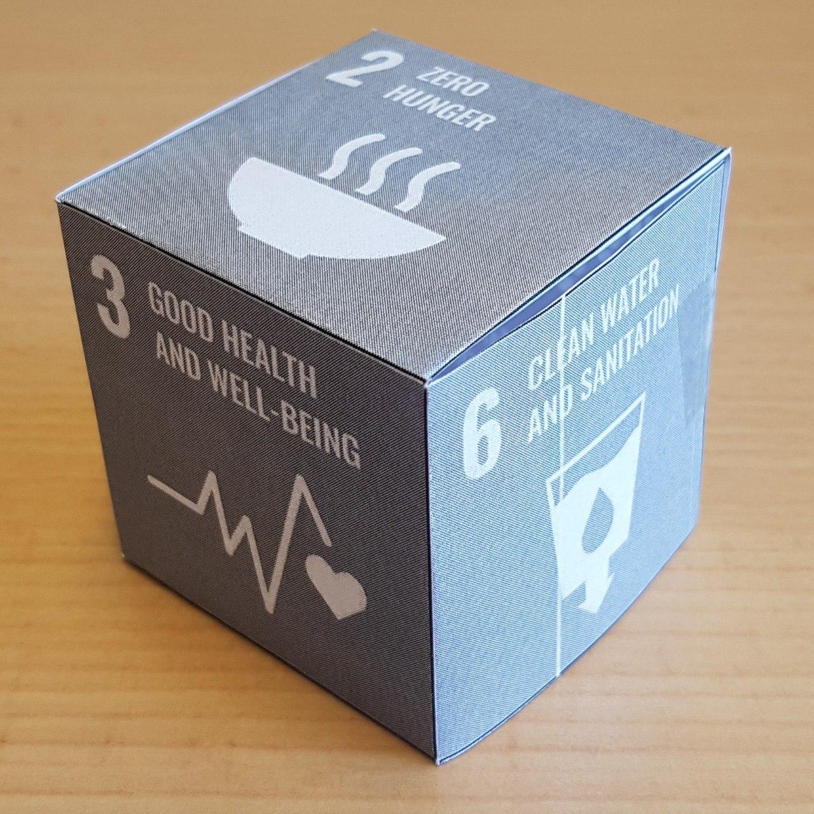
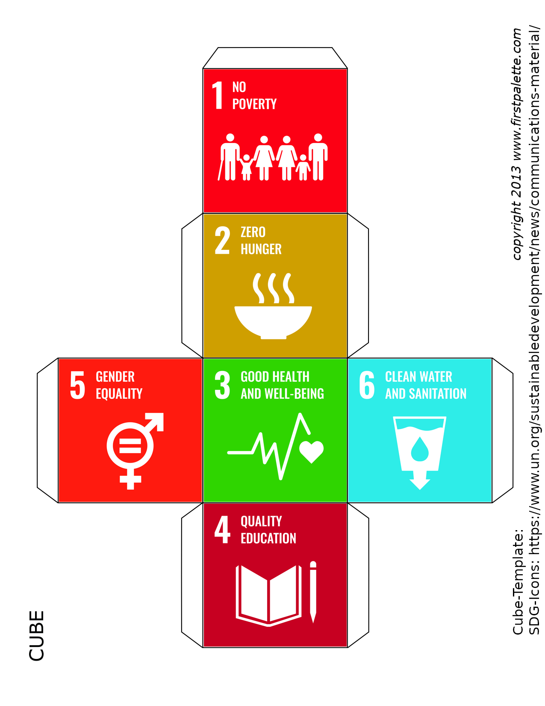
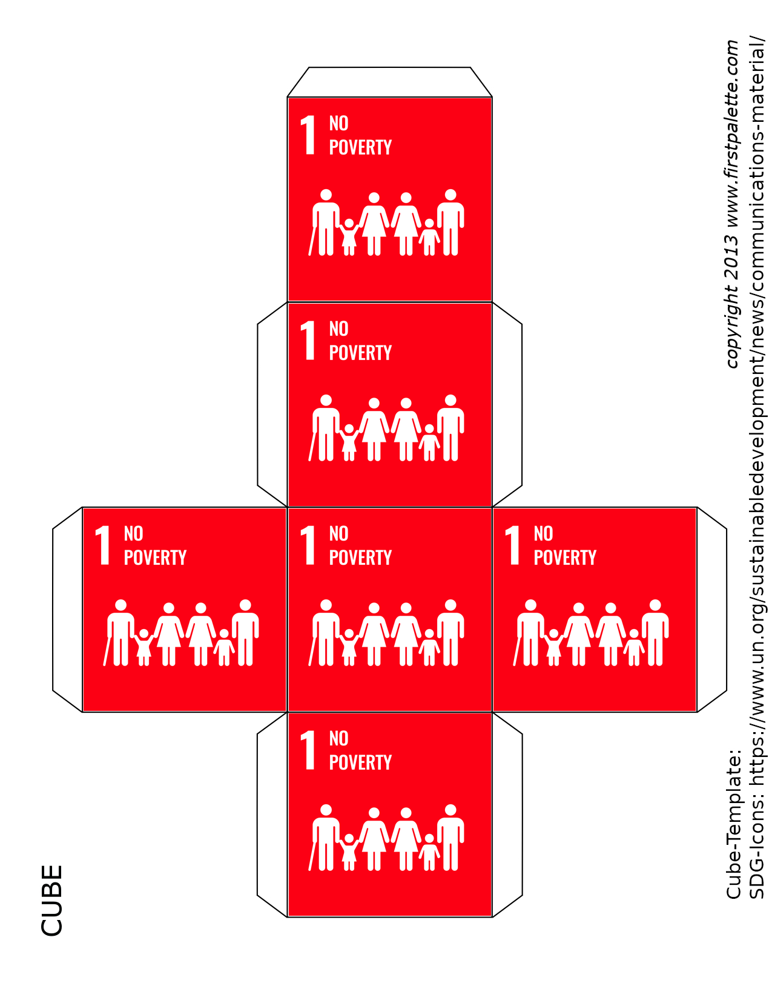

# Sustainable Development Goals Paper Cubes

Folders:
* [multiple-sdgs-per-cube](multiple-sdgs-per-cube) -> Cubes with different SDGs
* [one-sdg-per-cube](one-sdg-per-cube) -> Cubes with same SDG on each side

Summary PDFs:
* [All Cube-Templates in one PDF file](summary-pdfs/all-sdg-cubes-combined.pdf)
* [Cubes with multiple SDGs](summary-pdfs/multiple-sdgs-per-cube-combined.pdf)
* [Cubes with single SDG](summary-pdfs/single-sdg-per-cube-combined.pdf)

Code:
* [Jupyter Notebook](Generate-Cube-Templates.ipynb) for generation of templates.

## Example SDG-Cube

## Multiple SDG Icons

See Folders for all templates: [multiple-sdgs-per-cube](multiple-sdgs-per-cube)

## Single SDG Icons

See Folders for all templates: [one-sdg-per-cube](one-sdg-per-cube)

Icon source: https://www.un.org/sustainabledevelopment/news/communications-material/

